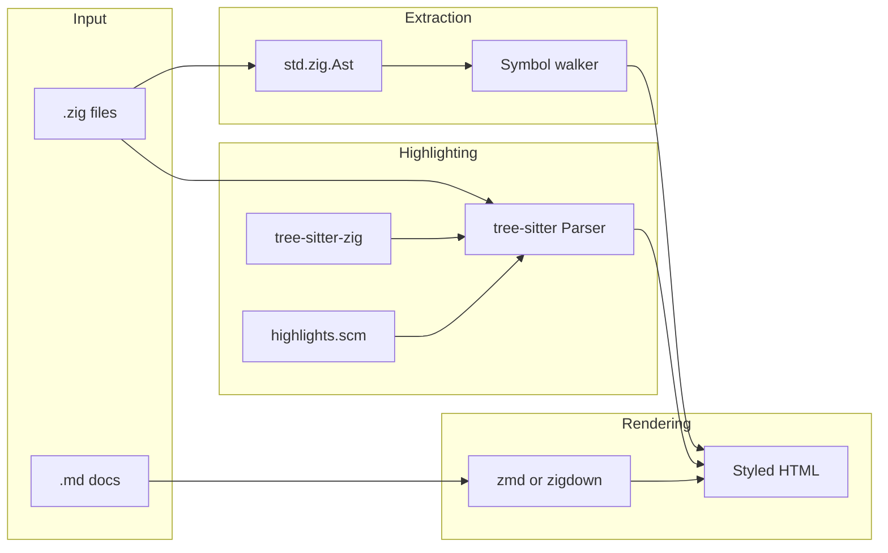

# zkdocs: Zig Documentation Generator — Implementation Plan

## Architecture overview

---

## 1. Parsing Zig code for modules, functions, parameters

**Use Zig’s standard library AST only** — no extra parser dependency. The compiler’s parser lives in `std.zig`; you get a full AST and can walk it to collect declarations and doc comments.

### 1.1 Parse and get root declarations

- **API:** `std.zig.Ast.parse(allocator, source, .zig)` returns an `Ast` (call `Ast.deinit(allocator)` when done).
- **Root declarations:** `tree.rootDecls()` returns a slice of `Node.Index` for top-level declarations (functions, variables, containers, tests, etc.).
- **Source text:** `tree.tokenSlice(token_index)` and `tree.source` give you the actual bytes for any token or range.

### 1.2 Map node tags to “symbol” types

- **Relevant node tags** (from [Ast.zig](https://github.com/ziglang/zig/blob/master/lib/std/zig/Ast.zig)): `fn_decl`, `fn_proto_simple`, `fn_proto_multi`, `fn_proto_one`, `fn_proto`, `container_decl`, `container_decl_trailing`, `global_var_decl`, `local_var_decl`, `test_decl`, etc.
- **Function nodes:** For `fn_decl` and the various `fn_proto_`* tags, the AST exposes “full” helpers that unpack the node into a struct (e.g. `fullFnProto(ast, node)`). That struct contains:
  - **Name:** from a token (e.g. `name_token`) — use `tree.tokenSlice(proto.name_token)`.
  - **Parameters:** stored in `extra_data`; the “full” helper returns a slice of param nodes (or you follow the same pattern as the AST’s internal helpers that decode `fn_proto`/`fn_proto_multi` via `extraData`/`extraDataSlice`).
  - **Return type:** present as a node or optional node in the same struct.
- **Containers (struct/enum/union):** Use the container “full” helpers (e.g. `fullContainerDecl`) to get member list; recurse on member nodes to get nested functions and fields.
- **Variables:** Use `fullVarDecl`-style helpers (or equivalent token/node traversal) to get name and type.

You’ll need to open [lib/std/zig/Ast.zig](https://github.com/ziglang/zig/blob/master/lib/std/zig/Ast.zig) and search for `fullFnProto`, `fullContainerDecl`, and param iteration; the exact field names are there. Implementation steps:

- For each root decl index, switch on `tree.nodeTag(decl_index)`.
- For functions: call the full function-proto helper, then iterate params (from the helper’s slice or via `extra_data` as in the AST code), and for each param get name/type via tokens/nodes and `tokenSlice`.
- For containers: call the full container helper and recurse on members.
- Build an in-memory “symbol” or “doc item” struct (name, kind, params, return type, optional doc string, source span) for use by the doc generator.

### 1.3 Doc comments

- Zig’s doc comments are `///` (and `//!` for file-level). The AST tracks them (see `unattached_doc_comment` in `renderError`).
- In practice: scan backwards from a declaration’s first token for preceding `string_literal` or doc-comment tokens (or use any existing AST helper that exposes “doc comment for this decl”) and associate that text with the decl. Use that as the “description” or “doc” field when generating docs.

### 1.4 Modules

- One Zig file = one module. So “parsing Zig for module info” = parsing each `.zig` file with `Ast.parse`, then using the steps above to collect all root (and optionally nested) symbols. You can derive “module name” from the file path (e.g. `src/foo/bar.zig` → `foo.bar` or `bar`).

---

## 2. Tree-sitter for code highlighting

**Libraries:** Use the official [tree-sitter/zig-tree-sitter](https://github.com/tree-sitter/zig-tree-sitter) Zig bindings and the [tree-sitter-grammars/tree-sitter-zig](https://github.com/tree-sitter-grammars/tree-sitter-zig) grammar (which includes [queries/highlights.scm](https://github.com/tree-sitter-grammars/tree-sitter-zig/blob/master/queries/highlights.scm)).

### 2.1 Dependencies and build

- Add **zig-tree-sitter** as a dependency in `build.zig.zon` (and in `build.zig` via `b.dependency("tree_sitter", ...)` and link the tree-sitter C library).
- Add **tree-sitter-zig** (grammar): either as a second dependency whose build produces a C library `tree_sitter_zig`, or vendor the grammar and use the repo’s `build.zig` to build the parser. The zig-tree-sitter README shows linking `tree_sitter_zig.artifact("tree-sitter-zig")` and calling `extern fn tree_sitter_zig() *ts.Language`.

### 2.2 Parsing a Zig snippet

- Create a `ts.Parser`, call `parser.setLanguage(language)` with `tree_sitter_zig()`.
- Call `parser.parseString(source, null)` to get a `Tree`; get `rootNode()` for the root.

### 2.3 Running the highlights query

- Tree-sitter highlighting is driven by a **highlights query** (the `.scm` file). The Zig bindings provide `ts.Query.create(language, query_string, &error_offset)` and `ts.QueryCursor` to run it.
- Load the contents of `queries/highlights.scm` from tree-sitter-zig (embed at compile time or load from file). Use that string in `Query.create`.
- Execute the query on the root node with `QueryCursor.exec(query, root_node)`, then iterate with `cursor.nextMatch()` (or equivalent capture iterator). Each capture gives you a node and a capture index; the query’s capture names (e.g. `@keyword`, `@function`) are in the query metadata.

### 2.4 Turning captures into styled HTML

- Collect all captures with (node start/end byte, capture name). Sort by start offset.
- Overlap handling: tree-sitter can produce overlapping ranges; use a simple policy (e.g. “later capture wins” or “prefer more specific name”) and merge/split so you have a list of non-overlapping (start, end, class) spans.
- Walk the source string and emit: raw text before first span, then `` + text + `` for each span, then remaining text. Escape HTML in the text (e.g. `<` → `<`).
- CSS: provide a stylesheet that defines `.highlight-keyword`, `.highlight-function`, `.highlight-type`, etc. (names from highlights.scm). You can mirror names like `keyword`, `function`, `type`, `comment`, `string`, `number` so one stylesheet works for multiple languages if you add more later.

---

## 3. Markdown to styled HTML

**Options:** Use an existing Zig markdown library so you don’t implement Markdown from scratch.

- **zmd** ([jetzig-framework/zmd](https://github.com/jetzig-framework/zmd)): Pure Zig, simple API (`zmd.parse(allocator, markdown, .{})` → HTML string). Supports headers, bold, italic, code, links, images, fenced code blocks (with optional language), lists. Custom formatters per node type (e.g. for code blocks you can pass a `block` formatter that runs your tree-sitter highlighter on the content and returns HTML).
- **zigdown** ([JacobCrabill/zigdown](https://github.com/JacobCrabill/zigdown)): More features (tables, task lists, TOC, alerts) and **already integrates Tree-sitter for code blocks** and can output HTML. Heavier dependency; good if you want “batteries included” and are okay with its non–CommonMark stance.
- **md4c-zig**: Zig bindings to md4c (C). Use if you need strict CommonMark and are okay with a C dependency.

**Recommended for “MkDocs-like” and “first and foremost Zig”:** Start with **zmd** for simplicity and full Zig control: (1) call `zmd.parse(allocator, doc_comment_or_md_content, .{})` for prose; (2) use a custom block formatter for fenced code blocks that runs your tree-sitter Zig highlighter (from step 2) when the info string is `zig`, and emits the styled HTML. If you later need tables/TOC, consider switching to zigdown or adding a second renderer for “content” pages.

**Styling:** The markdown library outputs HTML (e.g. `
`, `<h1>`, `<pre><code>`). You wrap the output in a minimal layout (e.g. `<html>`, `<head>` with a `<link>` to a CSS file, `<body>`, then the fragment). Your CSS defines typography, spacing, and the same `.highlight-`* classes used for code so that code inside markdown (and code blocks) is consistently styled.

---

## Suggested implementation order

1. **Build and parse** — Create a minimal Zig project with `build.zig` / `build.zig.zon`. Implement: read a single `.zig` file, call `std.zig.Ast.parse`, iterate `rootDecls()`, and for each `fn_decl`/`fn_proto_`* use the full function helper to print name + param count (to confirm you can get params).
2. **Symbol model** — Define structs for Module, Function, Param, Container, etc., and fill them from the AST (including doc comment association). Optionally recurse into containers so you have a full symbol tree per file.
3. **Tree-sitter highlight** — Add zig-tree-sitter and tree-sitter-zig, parse a string, run highlights.scm, then implement the “captures → sorted spans → HTML with classes” step and a small CSS file. Expose a function `highlightZigToHtml(allocator, source) → HTML`.
4. **Markdown** — Add zmd (or zigdown), render a short markdown string to HTML, then add a custom code-block formatter that calls your Zig highlighter when language is `zig`. Serve one static CSS file for both markdown and code.
5. **Doc generation** — Wire everything: for each `.zig` file, parse with Ast, build symbol list, for each symbol with a doc string render the doc with the markdown pipeline (with highlighted code blocks), and emit HTML sections (e.g. per function/struct) plus a simple index page. Optionally add a config (e.g. list of source dirs, output dir) and a single `zkdocs build` command.

---

## Key files and references

- **Zig AST:** `lib/std/zig/Ast.zig` and `Parse.zig` in the Zig repo; use `rootDecls()`, `nodeTag()`, `fullFnProto`/container/var helpers, `tokenSlice`, `firstToken`/`lastToken`.
- **Tree-sitter Zig bindings:** [tree-sitter/zig-tree-sitter](https://github.com/tree-sitter/zig-tree-sitter) (usage in README with `Parser`, `Query`, `QueryCursor`).
- **Zig grammar and highlights:** [tree-sitter-grammars/tree-sitter-zig](https://github.com/tree-sitter-grammars/tree-sitter-zig) — `queries/highlights.scm` for capture names.
- **Markdown:** [jetzig-framework/zmd](https://github.com/jetzig-framework/zmd) for `parse()` and custom formatters; [JacobCrabill/zigdown](https://github.com/JacobCrabill/zigdown) if you want built-in Tree-sitter and richer Markdown in one dependency.

This gives you a clear path: **std.zig.Ast for extraction**, **tree-sitter (Zig bindings + Zig grammar) for highlighting**, and **zmd (or zigdown) for markdown → HTML**, with one shared CSS layer for styles.